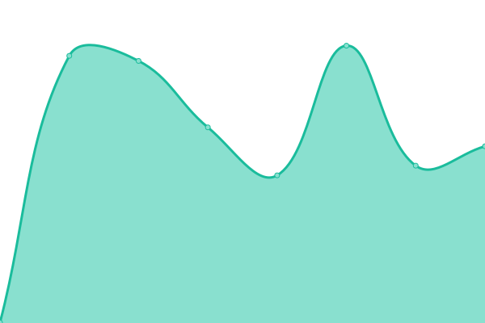

# [📈 Live Status](https://demo.upptime.js.org): <!--live status--> **🟧 Partial outage**

This repository contains the open-source uptime monitor and status page for [Fellow Consulting AG](http://www.fellow-consulting.de), powered by [Upptime](https://github.com/upptime/upptime).

With [Upptime](https://upptime.js.org), you can get your own unlimited and free uptime monitor and status page, powered entirely by a GitHub repository. We use [Issues](https://github.com/Fellow-Consulting-AG/upptime/issues) as incident reports, [Actions](https://github.com/Fellow-Consulting-AG/upptime/actions) as uptime monitors, and [Pages](https://demo.upptime.js.org) for the status page.

<!--start: status pages-->
<!-- This summary is generated by Upptime (https://github.com/upptime/upptime) -->
<!-- Do not edit this manually, your changes will be overwritten -->
<!-- prettier-ignore -->
| URL | Status | History | Response Time | Uptime |
| --- | ------ | ------- | ------------- | ------ |
|  [CloudIntegration Public](https://cloudintegration.eu/) | 🟥 Down | [cloud-integration-public.yml](https://github.com/Fellow-Consulting-AG/upptime/commits/HEAD/history/cloud-integration-public.yml) | 

 0ms
     
 | 

<a href="https://status.cloudintegration.eu/history/cloud-integration-public">0.00%</a>
    

|  [Extraction and Classifications API](https://fellowkv2.cloudintegration.eu/) | 🟩 Up | [extraction-and-classifications-api.yml](https://github.com/Fellow-Consulting-AG/upptime/commits/HEAD/history/extraction-and-classifications-api.yml) | 

 604ms
     
 | 

<a href="https://status.cloudintegration.eu/history/extraction-and-classifications-api">100.00%</a>
    

|  [Doc² App](https://doc2app.cloudintegration.eu/) | 🟩 Up | [doc-app.yml](https://github.com/Fellow-Consulting-AG/upptime/commits/HEAD/history/doc-app.yml) | 

 657ms
     
 | 

<a href="https://status.cloudintegration.eu/history/doc-app">100.00%</a>
    

|  [Doc² Landing Page](https://doc2landing.cloudintegration.eu/) | 🟥 Down | [doc-landing-page.yml](https://github.com/Fellow-Consulting-AG/upptime/commits/HEAD/history/doc-landing-page.yml) | 

 0ms
     
 | 

<a href="https://status.cloudintegration.eu/history/doc-landing-page">0.00%</a>
    

|  [Doc² Authorization Server](https://auth.cloudintegration.eu/) | 🟩 Up | [doc-authorization-server.yml](https://github.com/Fellow-Consulting-AG/upptime/commits/HEAD/history/doc-authorization-server.yml) | 

 521ms
     
 | 

<a href="https://status.cloudintegration.eu/history/doc-authorization-server">100.00%</a>
    

<!--end: status pages-->

[**Visit our status website →**](https://demo.upptime.js.org)

## 📄 License

- Powered by: [Upptime](https://github.com/upptime/upptime)
- Code: [MIT](./LICENSE) © [Fellow Consulting AG](http://www.fellow-consulting.de)
- Data in the `./history` directory: [Open Database License](https://opendatacommons.org/licenses/odbl/1-0/)
